# 🔗 Guía de Integración - Dosis vital: Tu aplicación de hidratación personal Frontend & Backend

## 📋 Índice
1. [Resumen de APIs](#resumen-de-apis)
2. [Configuración de Conexión](#configuración-de-conexión)
3. [Mapeo de Endpoints](#mapeo-de-endpoints)
4. [Flujos de Datos](#flujos-de-datos)
5. [Testing de Integración](#testing-de-integración)
6. [Troubleshooting](#troubleshooting)

## 🌐 Resumen de APIs

### **Backend APIs Implementadas**

#### **🔐 Autenticación (`/api/auth/`)**
- `POST /api/register/` - Registro de usuarios
- `POST /api/login/` - Inicio de sesión
- `POST /api/logout/` - Cerrar sesión
- `POST /api/token/refresh/` - Renovar token
- `GET /api/profile/` - Perfil de usuario
- `PUT /api/profile/` - Actualizar perfil
- `POST /api/change-password/` - Cambiar contraseña

#### **💧 Consumos (`/api/consumos/`)**
- `GET /api/consumos/` - Lista paginada de consumos
- `POST /api/consumos/` - Crear consumo
- `GET /api/consumos/{id}/` - Obtener consumo específico
- `PUT /api/consumos/{id}/` - Actualizar consumo
- `DELETE /api/consumos/{id}/` - Eliminar consumo
- `GET /api/consumos/stats/` - Estadísticas diarias
- `GET /api/consumos/cached_stats/` - Estadísticas con caché

#### **🍶 Bebidas (`/api/bebidas/`)**
- `GET /api/bebidas/` - Lista de bebidas disponibles
- `GET /api/bebidas/{id}/` - Obtener bebida específica
- `POST /api/bebidas/` - Crear bebida (admin)
- `PUT /api/bebidas/{id}/` - Actualizar bebida (admin)
- `DELETE /api/bebidas/{id}/` - Eliminar bebida (admin)

#### **🥤 Recipientes (`/api/recipientes/`)**
- `GET /api/recipientes/` - Lista de recipientes del usuario
- `POST /api/recipientes/` - Crear recipiente
- `GET /api/recipientes/{id}/` - Obtener recipiente específico
- `PUT /api/recipientes/{id}/` - Actualizar recipiente
- `DELETE /api/recipientes/{id}/` - Eliminar recipiente

#### **🎯 Metas (`/api/metas-diarias/`)**
- `GET /api/metas-diarias/` - Lista de metas diarias
- `POST /api/metas-diarias/` - Crear meta diaria
- `GET /api/goals/` - Meta fija (usuarios gratuitos)

#### **🔔 Recordatorios (`/api/recordatorios/`)**
- `GET /api/recordatorios/` - Lista de recordatorios
- `POST /api/recordatorios/` - Crear recordatorio
- `PUT /api/recordatorios/{id}/` - Actualizar recordatorio
- `DELETE /api/recordatorios/{id}/` - Eliminar recordatorio

#### **💰 Monetización (`/api/monetization/`)**
- `GET /api/monetization/status/` - Estado de suscripción
- `GET /api/monetization/features/` - Funcionalidades premium
- `GET /api/monetization/limits/` - Límites de uso
- `GET /api/monetization/no-ads/` - Verificación de anuncios

#### **⭐ Premium (`/api/premium/`)**
- `GET /api/premium/goal/` - Meta personalizada
- `GET /api/premium/beverages/` - Bebidas premium
- `GET /api/premium/reminders/` - Recordatorios ilimitados
- `POST /api/premium/reminders/` - Crear recordatorio premium

#### **📊 Estadísticas Premium (`/api/premium/stats/`)**
- `GET /api/premium/stats/history/` - Historial detallado
- `GET /api/premium/stats/summary/` - Resumen agregado
- `GET /api/premium/stats/trends/` - Tendencias de consumo
- `GET /api/premium/stats/insights/` - Insights personalizados

## ⚙️ Configuración de Conexión

### **Variables de Entorno**
```env
# Frontend (.env.local)
VITE_API_URL=http://localhost:8000/api
VITE_APP_NAME=Dosis vital: Tu aplicación de hidratación personal
VITE_ENABLE_PWA=true
VITE_ENABLE_DEBUG=false
```

### **Configuración de API Service**
```typescript
// src/services/api.ts
const API_BASE_URL = import.meta.env.VITE_API_URL || 'http://localhost:8000/api';

class ApiService {
  private api: AxiosInstance;
  
  constructor() {
    this.api = axios.create({
      baseURL: API_BASE_URL,
      timeout: 10000,
      headers: {
        'Content-Type': 'application/json',
      },
    });
  }
}
```

### **Interceptores de Autenticación**
```typescript
// Request interceptor
this.api.interceptors.request.use((config) => {
  if (this.token) {
    config.headers.Authorization = `Bearer ${this.token}`;
  }
  return config;
});

// Response interceptor
this.api.interceptors.response.use(
  (response) => response,
  (error) => {
    if (error.response?.status === 401) {
      this.clearToken();
      window.location.href = '/login';
    }
    return Promise.reject(error);
  }
);
```

## 🔄 Mapeo de Endpoints

### **Frontend → Backend Mapping**

| Frontend Service | Backend Endpoint | Método | Descripción |
|------------------|------------------|--------|-------------|
| `authService.login()` | `/api/login/` | POST | Iniciar sesión |
| `authService.register()` | `/api/register/` | POST | Registro de usuario |
| `authService.logout()` | `/api/logout/` | POST | Cerrar sesión |
| `authService.getCurrentUser()` | `/api/profile/` | GET | Obtener perfil |
| `consumosService.getConsumos()` | `/api/consumos/` | GET | Lista de consumos |
| `consumosService.createConsumo()` | `/api/consumos/` | POST | Crear consumo |
| `consumosService.getEstadisticas()` | `/api/consumos/stats/` | GET | Estadísticas diarias |
| `bebidasService.getBebidas()` | `/api/bebidas/` | GET | Lista de bebidas |
| `recipientesService.getRecipientes()` | `/api/recipientes/` | GET | Lista de recipientes |
| `monetizationService.getSubscriptionStatus()` | `/api/monetization/status/` | GET | Estado de suscripción |
| `monetizationService.getPremiumFeatures()` | `/api/monetization/features/` | GET | Funcionalidades premium |

## 📊 Flujos de Datos

### **1. Flujo de Autenticación**


### **2. Flujo de Registro de Consumo**

```mermaid
sequenceDiagram
    participant U as Usuario
    participant F as Frontend
    participant B as Backend
    
    U->>F: Hace clic en "250ml"
    F->>B: POST /api/consumos/
    B->>F: Consumo creado
    F->>B: GET /api/consumos/stats/
    B->>F: Estadísticas actualizadas
    F->>U: Progreso actualizado
```


### **3. Flujo de Estadísticas Premium**

```mermaid
sequenceDiagram
    participant U as Usuario Premium
    participant F as Frontend
    participant B as Backend
    
    U->>F: Ve estadísticas
    F->>B: GET /api/premium/stats/history/
    B->>F: Historial detallado
    F->>B: GET /api/premium/stats/trends/
    B->>F: Tendencias
    F->>B: GET /api/premium/stats/insights/
    B->>F: Insights personalizados
    F->>U: Dashboard premium
```


## 🧪 Testing de Integración

### **Configuración de Tests**
```typescript
// vitest.config.ts
export default defineConfig({
  test: {
    globals: true,
    environment: 'jsdom',
    setupFiles: ['./src/tests/setup.ts'],
    coverage: {
      provider: 'v8',
      reporter: ['text', 'json', 'html']
    }
  }
});
```

### **Tests de Componentes**
```typescript
// src/tests/components/Button.test.tsx
describe('Button Component', () => {
  it('renders with children', () => {
    render(<Button>Click me</Button>);
    expect(screen.getByText('Click me')).toBeInTheDocument();
  });
});
```

### **Tests de Servicios**
```typescript
// src/tests/services/auth.test.ts
describe('AuthService', () => {
  it('should login successfully', async () => {
    const mockResponse = { user: {}, tokens: {} };
    mockApiService.post.mockResolvedValue(mockResponse);
    
    const result = await authService.login(credentials);
    expect(result).toEqual(mockResponse);
  });
});
```

### **Tests de Integración**
```typescript
// src/tests/integration/Dashboard.test.tsx
describe('Dashboard Integration', () => {
  it('renders dashboard with user information', async () => {
    renderWithProviders(<Dashboard />);
    
    await waitFor(() => {
      expect(screen.getByText('¡Hola, testuser! 👋')).toBeInTheDocument();
    });
  });
});
```

## 🔧 Comandos de Testing

```bash
# Ejecutar todos los tests
npm run test

# Tests con UI
npm run test:ui

# Tests en modo watch
npm run test:watch

# Coverage
npm run test:coverage

# Tests específicos
npm run test -- --grep "Button"
```

## 🐛 Troubleshooting

### **Problemas Comunes**

#### **1. Error de CORS**
```javascript
// Backend: settings.py
CORS_ALLOWED_ORIGINS = [
    "http://localhost:3000",
    "http://127.0.0.1:3000",
]
```

#### **2. Token Expirado**
```typescript
// Frontend: Auto-refresh token
if (authService.isTokenExpiring()) {
  await authService.refreshToken();
}
```

#### **3. Error 401 - No Autorizado**
```typescript
// Verificar token en localStorage
const token = localStorage.getItem('access_token');
if (!token) {
  // Redirigir a login
}
```

#### **4. Error de Red**
```typescript
// Retry automático
const retryRequest = async (fn, retries = 3) => {
  try {
    return await fn();
  } catch (error) {
    if (retries > 0) {
      await new Promise(resolve => setTimeout(resolve, 1000));
      return retryRequest(fn, retries - 1);
    }
    throw error;
  }
};
```

### **Debug de APIs**

#### **1. Logs de Red**
```typescript
// Interceptor de debug
this.api.interceptors.request.use((config) => {
  console.log('Request:', config.method?.toUpperCase(), config.url);
  return config;
});

this.api.interceptors.response.use(
  (response) => {
    console.log('Response:', response.status, response.config.url);
    return response;
  },
  (error) => {
    console.error('Error:', error.response?.status, error.config?.url);
    return Promise.reject(error);
  }
);
```

#### **2. Network Tab**
- Abrir DevTools → Network
- Filtrar por XHR/Fetch
- Verificar headers de autorización
- Revisar status codes

#### **3. Console Logs**
```typescript
// En desarrollo
if (import.meta.env.DEV) {
  console.log('API Base URL:', API_BASE_URL);
  console.log('User Token:', authService.getAccessToken());
}
```

## 📈 Optimizaciones

### **1. Caché de Datos**
```typescript
// React Query para caché automático
const { data: consumos } = useQuery({
  queryKey: ['consumos'],
  queryFn: () => consumosService.getConsumos(),
  staleTime: 5 * 60 * 1000, // 5 minutos
});
```

### **2. Lazy Loading**
```typescript
// Carga lazy de componentes
const Statistics = lazy(() => import('@/pages/Statistics'));
const Profile = lazy(() => import('@/pages/Profile'));
```

### **3. Debounce en Búsquedas**
```typescript
// Debounce para búsquedas
const debouncedSearch = useMemo(
  () => debounce((query: string) => {
    searchConsumos(query);
  }, 300),
  []
);
```

## 🚀 Deployment

### **Variables de Producción**
```env
VITE_API_URL=https://api.hydrotracker.app
VITE_APP_NAME=Dosis vital: Tu aplicación de hidratación personal
VITE_ENABLE_PWA=true
VITE_ENABLE_ANALYTICS=true
```

### **Build de Producción**
```bash
npm run build
npm run preview
```

### **Verificación de Integración**
```bash
# Tests de integración
npm run test:run

# Coverage
npm run test:coverage

# Type checking
npm run type-check

# Linting
npm run lint
```

---

**¡Con esta guía, el frontend y backend de Dosis vital: Tu aplicación de hidratación personal están completamente integrados y listos para producción! 🚀💧**
